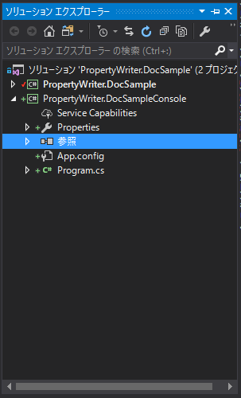
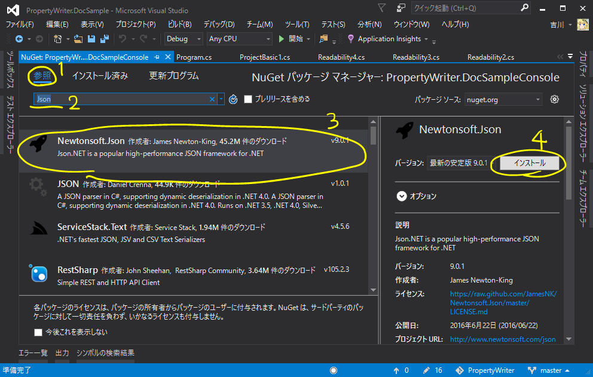

# 出力したデータベースの使い方

プロジェクトを保存すると、プロジェクトファイル(`.pwproj`)と、
データベースファイル(デフォルトでは`.json`)が出力されます。
データベースファイルには、PropertyWriterを使って編集して得られたデータが保存されており、
これを実際に開発するアプリケーションから読み込んで利用することになります。

デフォルトでは、PropertyWriterはデータベースを **Json.NET(Newtonsoft.Json)** を使ってシリアライズし、保存しています。
ここでは、Json.NETの使い方に明るくない方に向けて、簡単に使い方を説明します。

## Json.NETを導入

まず、データベースの読み込みを行いたい(C#の)プロジェクトをソリューションエクスプローラーで探します。
そのプロジェクトの「参照」の項目を右クリックして、コンテキスト メニューから「NuGetパッケージの管理」をクリックします。



するとNuGetの管理をするための画面が開きます。この画面から、

1. 「参照」タブをクリック
2. 「Json」などと入力して、「Newtonsoft.Json」を検索
3. 「Newtonsoft.Json」が見つかったらそれをクリック
4. 右側の「インストール」ボタンをクリック
5. インストール完了を待つ



以上の手順で、Json.NETを導入することができます。
導入できたら、早速データベースを読み込んでみましょう。

## Json.NETの使い方

`JsonConverter`クラスの静的メソッドである`DeserializeObject`メソッドを使うことで、
json文字列をC#のインスタンスに変換することができます。

使い方の例を以下に示します。以下のような`MyProject`クラスのデータをPropertyWriterで編集し、
`BasicSample.json`というファイルに出力しているものと仮定します。

```csharp
using System;
using System.IO;
using Newtonsoft.Json;
using PropertyWriter.Annotation;

[PwProject]
public class MyProject
{
	[PwMaster]
	public int Data { get; set; }
	[PwMaster]
	public Hoge Hoge { get; set; }
}

public class Hoge
{
	[PwMember]
	public int X { get; set; }
	[PwMember]
	public string Message { get; set; }
	[PwMember]
	public bool Check { get; set; }
}

class Program
{
	static void Main(string[] args)
	{
		string json;
		using (var file = new StreamReader("BasicSample.json"))
		{
			json = file.ReadToEnd();
		}
		var obj = JsonConvert.DeserializeObject<MyProject>(json);

		Console.WriteLine(obj.Data);
		Console.WriteLine(obj.Hoge.X);
		Console.WriteLine(obj.Hoge.Message);
		Console.WriteLine(obj.Hoge.Check);
		Console.ReadKey();
	}
}
```

これを実行すると、各プロパティにPropertyWriterで設定した値が表示されます。
