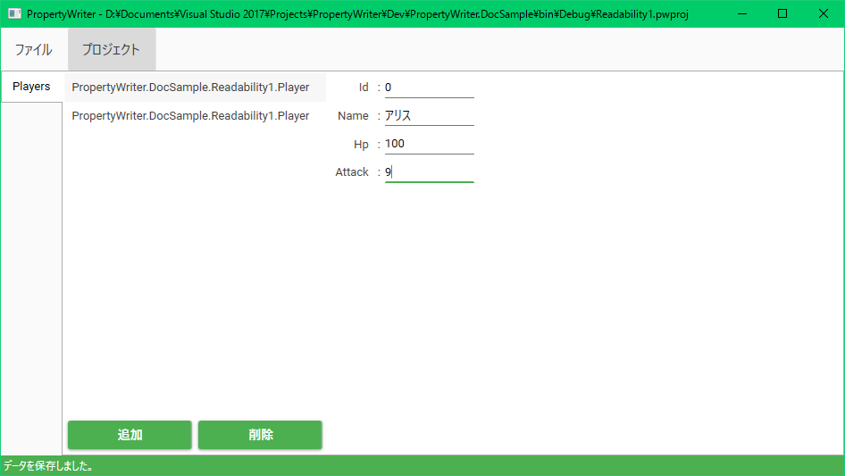
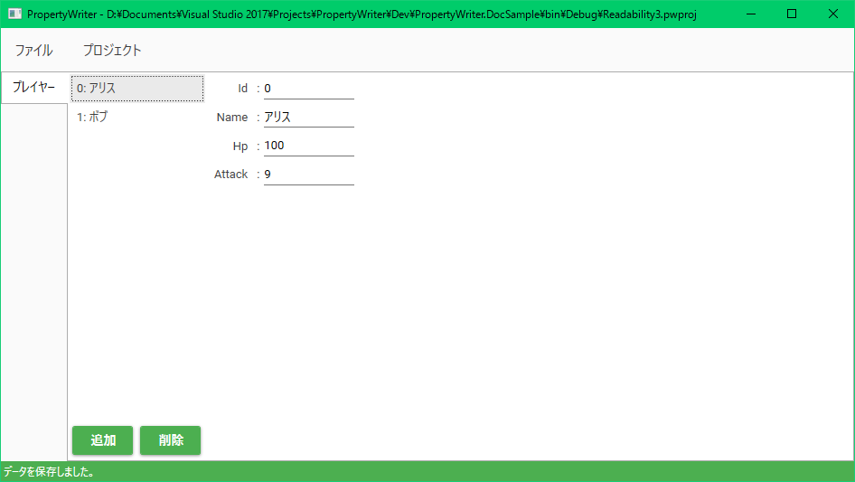
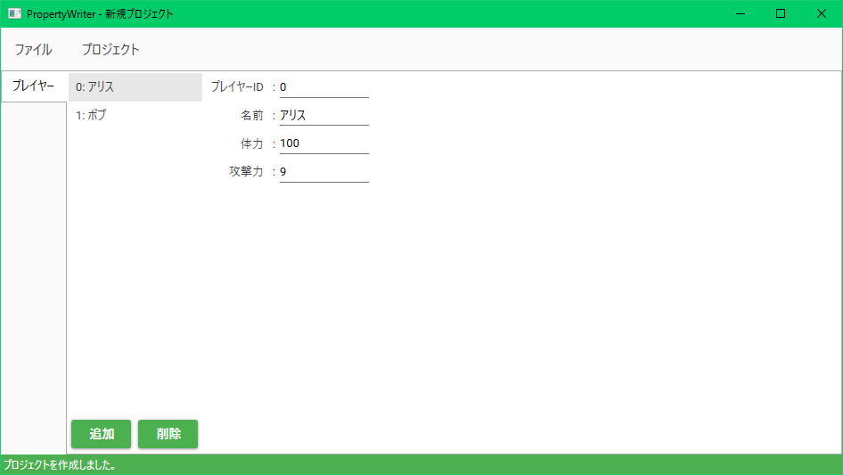

# データ編集作業を分かりやすくする機能

ゲームのデータを、プログラマでないチームメイトに調整してもらう場面に出会うこともあるでしょう。
そんなとき、PropertyWriterで表示されるフィールド名がプログラムのプロパティ名そのままでは
分かりづらいことも多いと思います。

PropertyWriterには、フィールドの意味などを分かりやすくする機能がいくつかあります。
以下のような型定義を考えてみましょう。

```csharp
[PwProject]
public class Project
{
    [PwMaster]
    public Player[] Players { get; set; }
}

public class Player
{
    [PwMember]
    public int Id { get; set; }
    [PwMember]
    public string Name { get; set; }
    [PwMember]
    public int Hp { get; set; }
    [PwMember]
    public int Attack { get; set; }
}
```

これをPropertyWriterで読み込むと次のようになります：


ほとんどのデータ名が英語の識別子で、分かりづらくなってしまっていると思います。
PropertyWriterではこのうち、

* 一番左のタブに表示される名前(マスターの名前)
* リストに表示されるクラスの文字列表現(ToStringの結果)
* 各プロパティに対するフィールドに書かれるタイトル

をカスタマイズすることができます。その方法を説明します。

ちなみにデフォルトでは、

* マスターの名前にはマスター プロパティのプロパティ名が表示されます。
* クラスの文字列表現は`ToString()`が使われます。（変更する場合も`ToString()`をオーバーライドするだけです。）
* フィールド名は対応するプロパティ名が表示されます。

## マスターの名前をカスタマイズ

マスター、つまり`[PwMaster]`をつけたプロパティに名前をつけることができます。
`[PwMaster]`の第一引数に名前を渡すと、それがプロパティの名前となります。
次のようにしてみましょう。

```csharp
[PwProject]
public class Project
{
    [PwMaster("プレイヤー")]
    public Player[] Players { get; set; }
}

public class Player
{
    [PwMember]
    public int Id { get; set; }
    [PwMember]
    public string Name { get; set; }
    [PwMember]
    public int Hp { get; set; }
    [PwMember]
    public int Attack { get; set; }
}
```

PropertyWriter上では次のような見た目になります。

一番左のタブに名前がついたことが分かると思います。

## 文字列表現の指定

まだ、リストに表示されるオブジェクト情報がただの型名になっていて分かりづらいと思います。
ここに好きな文字列を表示したい場合は、データ入力対象のクラスにお好みの`ToString()`メソッドを実装してください。
次のように、`Player`クラスに`ToString()`メソッドを実装しましょう。

```csharp
[PwProject]
public class Project
{
    [PwMaster("プレイヤー")]
    public Player[] Players { get; set; }
}

public class Player
{
    [PwMember]
    public int Id { get; set; }
    [PwMember]
    public string Name { get; set; }
    [PwMember]
    public int Hp { get; set; }
    [PwMember]
    public int Attack { get; set; }

    public override string ToString() => $"{Id}: {Name}";
}
```

すると、PropertyWriter上では次のような見た目になります：

リストにIDと分かりやすい名前を表示することができました。

この文字列表現は、クラスのプロパティとしてクラスを持たせたときなど、様々な場所で使われます。
ここで実装した`ToString()`メソッドの中で例外が発生するとエラーとなるするため、注意してください。

## フィールド名の指定

最後に、右側の各フィールドの左についているフィールド名も指定してみましょう。
フィールドを提供したいプロパティには`[PwMember]`属性が付いていると思いますが、
その`[PwMember]`属性の第一引数にフィールド名を指定します。
次のように、`Player`クラスの各プロパティにフィールド名を追加してみましょう。

```csharp
[PwProject]
public class Project
{
    [PwMaster("プレイヤー")]
    public Player[] Players { get; set; }
}

public class Player
{
    [PwMember("プレイヤーID")]
    public int Id { get; set; }
    [PwMember("名前")]
    public string Name { get; set; }
    [PwMember("体力")]
    public int Hp { get; set; }
    [PwMember("攻撃力")]
    public int Attack { get; set; }

    public override string ToString() => $"{Id}: {Name}";
}
```

PropertyWriter上では次のような見た目になります。

各フィールドに名前を付けることができました。