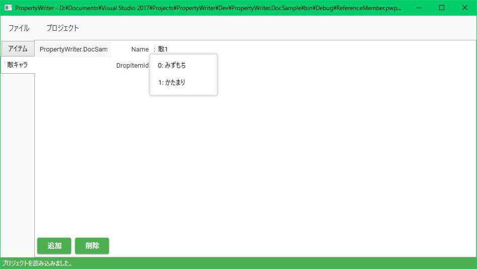

# 他のマスターを参照する

マスターで管理されているデータの中から１つをIDで参照する機能があります。
例えばRPGなどで、敵キャラのドロップアイテムを数値のID指定する代わりに、
アイテムのマスターに登録されているアイテムからドロップダウンリストで選ぶ機能を提供できます。

参照元のプロパティに`[PwReferenceMember]`属性を付与してください。
そのプロパティの型は`int`型にしてください。
引数は以下のとおりです：

```csharp
[PwReferenceMember(masterKey: "参照先のMasterに設定したKey", IdFieldName: "参照先の型のIDを表すプロパティ名")]
```

例えば、`[PwMaster]`属性のkeyに"Items"が指定されたマスターを参照するなら以下のようにしてください。

```csharp
[PwProject]
public class Project
{
    [PwMaster("アイテム", "Items")]
    public Item[] ItemData { get; set; }
    [PwMaster("敵キャラ", "Enemies")]
    public Enemy[] EnemyData { get; set; }
}

public class Item
{
    [PwMember]
    public int Id { get; set; }
    [PwMember]
    public string Name { get; set; }

    public override string ToString() => $"{Id}: {Name}";
}

public class Enemy
{
    [PwMember]
    public string Name { get; set; }

    // key に "Items" が設定されたマスターを参照する
    // idFieldName に Item クラスのIDとなるプロパティの名前を渡す
    [PwReferenceMember("Items", nameof(Item.Id))]
    public int DropItemId { get; set; }
}
```

以上のようなプロジェクトをPropertyWriterで読み込ませて、アイテムの情報を次のように設定します。


すると、敵キャラの編集から次のようにドロップダウンリストでアイテムを参照できます。

