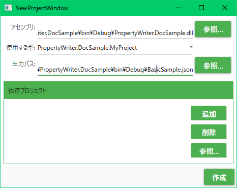
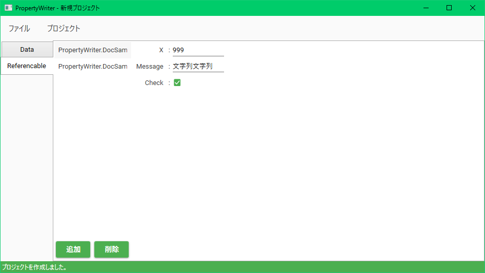

# PropertyWriterの基本的な使い方

## 使い方

PropertyWriterでは、あなたがC#などの.NET言語で宣言したクラスに実際に読み込むためのデータベースを作成し、ファイルに保存することができます。
たとえば、ゲームの敵キャラの能力値を保持するクラスを作って、実際の敵キャラクターたちのデータをPropertyWriterで編集するなど、
ゲームに使うデータベースをファイルに保存するようにすることで、ハードコーディングから解放されます。

PropertyWriterでのデータ編集をはじめるためには、**プロジェクト ファイル**(拡張子はふつう`.pwproj`)を作成する必要があります。
プロジェクトファイルは、データ編集作業を管理するためのファイルです。
次の節から、プロジェクトを作成していきましょう。

### プロジェクトで使うプロジェクト型の準備

プロジェクトを1つ作成することで、1つの**プロジェクト型**に対するデータの編集をすることができます。
プロジェクトを作成する前に、あなたのクラスに手を加えてプロジェクト型として扱う必要があります。

あなたの宣言した型を**プロジェクト型**として扱えるようにするには、その型に`[PwProject]`属性を付与します。
プロジェクト型が`public`である必要があることに注意してください。
1つのアセンブリに複数のプロジェクト型を含めることもできます。

プロジェクト型のメンバーで、PropertyWriterで編集したいプロパティには`[PwMaster]`属性を付与します。

たとえば、次のようにプロジェクト型を宣言します。

```csharp
[PwProject]         // データ編集プロジェクトのトップにつけてプロジェクト型にする
public class MyProject
{
    [PwMaster]      // 入力できるフィールドを提供するプロパティにつける(プロジェクト型内の場合)
    public int Data { get; set; }
    [PwMaster]
    public string Message { get; set; }
}
```

上の例では、`MyProject`クラスがプロジェクト型として扱えるようになっています。
それによって、`[PwMaster]`属性がついている`Data`や`Message`プロパティの値を編集することができます。

### プロジェクトの作成

準備ができたら、その(C#の)プロジェクトをビルドすることでアセンブリ(dllまたはexe)を生成してください。
ここでは`PropertyWriter.DocSample.dll`というアセンブリを生成しました。

前述のとおり、PropertyWriterでは、プロジェクト型に属するプロパティにデータを入力し、できたデータを保存することができます。
ある一つのプロジェクト型に対するデータ入力作業を管理するファイルを、**プロジェクト**と呼びます。
プロジェクトファイルの拡張子は基本的に`.pwproj`です。

では作業を開始するために、PropertyWriterを起動します。
「ファイル > 新規プロジェクト」をクリックすると、以下のようなプロジェクト設定画面が表示されます。
ここに、プロジェクトの設定を入力してから"作成"ボタンでプロジェクトを作成できます。
設定項目をこの後示します。



設定項目は以下の通りです。

|項目名|説明|
|---|---|
|アセンブリ|データ入力の対象となるプロジェクト型があるアセンブリ(dllまたはexe)を絶対パスで指定します。|
|使用する型|"アセンブリ"で指定したアセンブリ内にあるプロジェクト型から、このプロジェクトで作業対象となる型をドロップダウンリストで選択します。|
|出力パス|入力したデータを出力するパスを絶対パスで指定します。プロジェクトファイルの保存先ではないことに注意してください。|
|依存プロジェクト|ここにプロジェクトファイルを設定することで、他のプロジェクトの出力に保存されているデータを利用することができます(今回は説明しません)。複数設定できます。|

"参照…"ボタンでWindowsのファイル エクスプローラーを利用できます。
今回は、アセンブリに`PropertyWriter.DocSample.dll`（プロジェクト型が含まれるアセンブリ）、
使用する型に`PropertyWriter.DocSample.MyProject`、
出力パスに適当なファイル名を指定します。

"作成"ボタンでプロジェクトを作成すると次のような画面になり、データ入力作業を始めることができます。
`Data`タブや`Message`タブの値を編集してみましょう。
（このままだと`Data`と`Message`を行き来するのにタブを切り替えないといけなくて面倒かもしれません。
さらに便利にする方法は「入れ子になったデータ」の節をご覧ください。）



### プロジェクトの保存

気が済むまでデータを編集してみたら、プロジェクトを保存しましょう。

「ファイル > プロジェクトの保存」または「ファイル > プロジェクトの別名保存」をクリックすると、
プロジェクトの保存場所を尋ねるダイアログが表示されます。
このダイアログでプロジェクトファイルを保存することができます。
そして同時にプロジェクト上で編集したデータがプロジェクト設定で指定した出力パスに出力されます。

## 入れ子になったデータ

プロジェクト型の中にさらに、クラス型のプロパティがある場合、
そのクラスのメンバーであるプロパティにも値を入力することが可能です。
そういったクラスのメンバーには、`[PwMaster]`属性の代わりに`[PwMember]`属性を付けます。

つまり、プロジェクト型のプロパティには`[PwMaster]`属性を、それ以外の型のプロパティには`[PwMember]`属性を付けるということです。

```csharp
[PwProject]         // データ編集プロジェクトのトップにつけてプロジェクト型にする
public class MyProject
{
    [PwMaster]      // 入力できるフィールドを提供するプロパティにつける(プロジェクト型内の場合)
    public int Data { get; set; }
    [PwMaster]
    public Hoge ClassValue { get; set; }　   // Hoge型のプロパティ
}

// publicなクラスとして定義すること
public class Hoge
{
    [PwMember]      // 入力できるフィールドを提供するプロパティにつける(プロジェクト型以外の場合)
    public int X { get; set; }
    [PwMember]
    public int Y { get; set; }
}
```

`[PwMaster]`属性のついたプロパティはPropertyWriterではタブとして表示されます。
`[PwMaster]`属性には`int`などのプリミティブ型のプロパティより、クラス型や配列型のプロパティを使う方が作業がしやすいです。

`[PwMember]`属性のついたプロパティは入力できるフィールドとして表示されます。

また、入れ子になっているクラスも`public`である必要があることに注意してください。