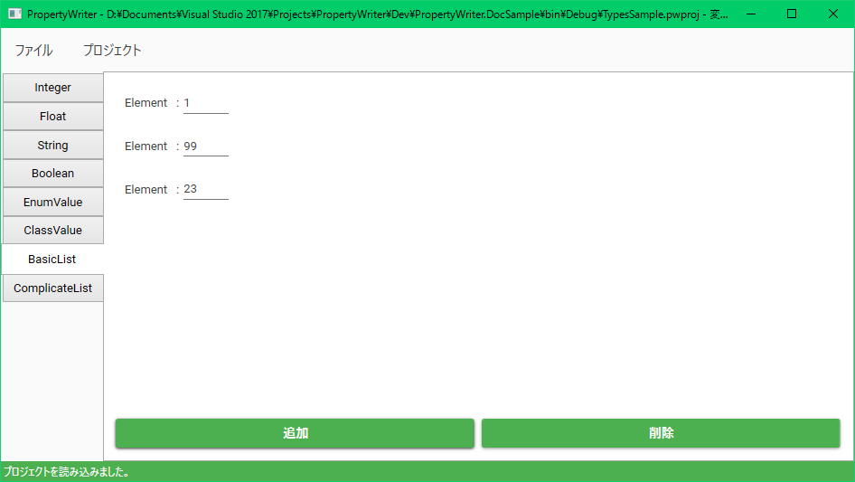

# PropertyWriterの基本的な使い方

## 基本的な使いかた

PropertyWriterで作業をする前に、データ入力したいクラスを宣言する必要があります。
宣言の例をまず示します。

```csharp
public class Hoge
{
    [PwMember]      // フィールドを提供するプロパティにつける
    public int X { get; set; }
    [PwMember]
    public string Message { get; set; }
    [PwMember]
    public bool Check { get; set; }
}

[PwProject]         // データ編集プロジェクトのトップにつける（プロジェクト型）
public class MyProject
{
    [PwMaster]      // プロジェクト型でのPwMember
    public int[] Data { get; set; }
    [PwMaster]
    public Hoge[] Referencable { get; set; }
}
```

`[PwProject]`が付いた型を**プロジェクト型**、`[PwMaster]`が付いたプロパティを**マスター プロパティ**と呼びます。
プロジェクト型はひとつのアセンブリにいくつあっても構いません。

準備ができたら、そのプロジェクトをビルドすることでアセンブリ(dllまたはexe)を生成してください。
ここでは`PropertyWriter.DocSample.dll`というアセンブリを生成しました。

PropertyWriterでは、プロジェクト型に属するプロパティにデータを入力していくことができます。
ある一つのプロジェクト型に対するデータ入力作業を管理するファイルを、**プロジェクト**と呼びます。
プロジェクトファイルの拡張子は基本的に`.pwproj`です。

ではプロジェクトを作成するために、PropertyWriterを起動します。
「ファイル > 新規プロジェクト」をクリックすると、以下のようなプロジェクト設定画面が表示されます。
ここに、プロジェクトの設定を入力してから"作成"ボタンでプロジェクトを作成できます。
設定項目をこの後示します。


設定項目は以下の通りです。

|項目名|説明|
|---|---|
|アセンブリ|データ入力の対象となるプロジェクト型があるアセンブリ(dllまたはexe)を指定します。|
|使用する型|"アセンブリ"で指定したアセンブリ内にあるプロジェクト型から、このプロジェクトで作業対象となる型をドロップダウンリストで選択します。|
|出力パス|入力したデータを出力するパスを指定します。プロジェクトファイルの保存先とは違うことに注意してください。|
|依存プロジェクト|ここにプロジェクトファイルを設定することで、他のプロジェクトの出力に保存されているデータを利用することができます(詳しくは後述)。複数設定できます。|

"参照…"ボタンでWindowsのファイル エクスプローラーを利用できます。

"作成"ボタンでプロジェクトを作成すると次のような画面になり、データ入力作業を始めることができます。


---

データ入力のための型定義について、詳しく説明します。

基本的にデータ入力をしたいプロパティを`[PwMember]`属性で宣言しますが、
データ入力したい型の構造で一番上にくるクラスに`[PwProject]`属性を付け、
`[PwProject]`属性のついた型の中では`[PwMember]`属性の代わりに`[PwMaster]`属性を使います。

## 対応している型

以下の型を持つプロパティに`[PwMember]`属性や`[PwMaster]`属性をつけると、データ入力をするフィールドが提供されます。

* `int`
* `float`
* `bool`
* `string`
* 列挙型
* 配列
* クラス/構造体
    * 引数なしコンストラクタが定義されている必要があります

`[PwProject]`, `[PwMaster]`, `[PwMember]`属性がついた型には引数なしのコンストラクタが定義されている必要があります。
また、クラス間の参照関係が循環しているとエラーとなります。

## フィールド サンプル

それぞれの型のフィールドは以下のように表示されます。


上から順に、`int`, `float`, `string`, `bool`, 列挙体, クラス, 単純な(intなどの)リスト, 複雑な(クラスなどの)リストです。

左のタブから単純なリストである"BasicList"を選択すると、次のようにリストを編集するUIが表示されます。

追加/削除ボタンで要素を編集することができます。

左のタブから複雑なリストである"ComplicateList"を選択すると、次のようにリストを編集するUIが表示されます。

追加/削除ボタンで要素を編集することができます。左側のリストから要素をクリックすると、
右側にその要素のプロパティ情報を編集するフィールドが表示されます。
